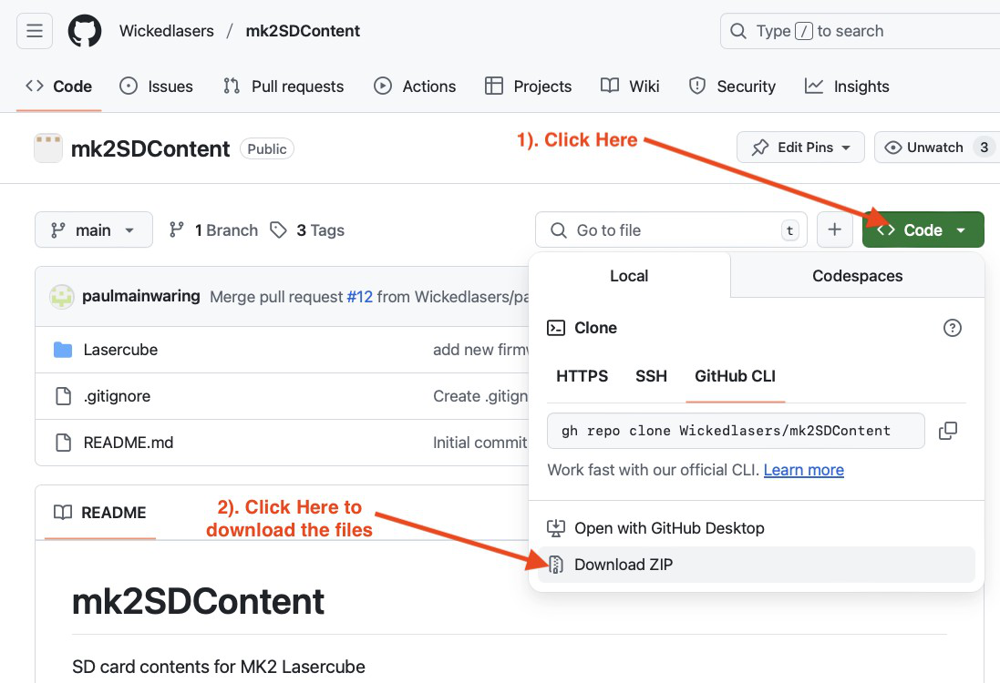

# mk2SDContent

SD card contents for MK2 Lasercube

## SD Card Information

The Ultra MK2 / Evo laser cube is supplied with a pre-loaded micro SD card containing all demo laser shows, Playlists, and MIDI mappings for APC40 MK2 and APC mini MK2.

If you need additional SD cards then these can be obtained from places like Amazon.

The card which we have tested and guarantee to work with the device is the [Lexar A2 Silver Plus 64Gb micro SD card](https://americas.lexar.com/product/lexar-professional-silver-plus-microsdxc-uhs-i-card/).

The laser cube supports this range of cards up to 2Tb.

> **Note:** *Please make sure you do not purchase inferior / cheaper micro SD cards, as these could fail to correctly stream the laser shows which require low latency and high throughput in order to stream simultaneous audio and projection data.*

The micro SD cards usually come pre-formatted in the Ex-FAT filesystem format, and this is the preferred format in order to take advantage of >32Gb space compared to FAT32.

If you need to format a card manually then please use Ex-FAT with default settings offered by your operating system.

If you need to obtain the most up to date files that are provided on the factory micro SD card then these are available from here: <https://github.com/Wickedlasers/mk2SDContent>

You will need to unzip the downloaded file before copying the "Lasercube" folder into the root of your new micro SD card. If you are using a card with the "Lasercube" folder already present then you can either rename the old folder, or delete the folder before copying the new folder you just downloaded. If you delete the folder then you will **lose any custom playlists or MIDI mappings**.

> **Note:** *Please also rename the SD card volume name to "WL" without the quotes in order for LaserOS to see it when exporting custom playlists to the SD card.*
